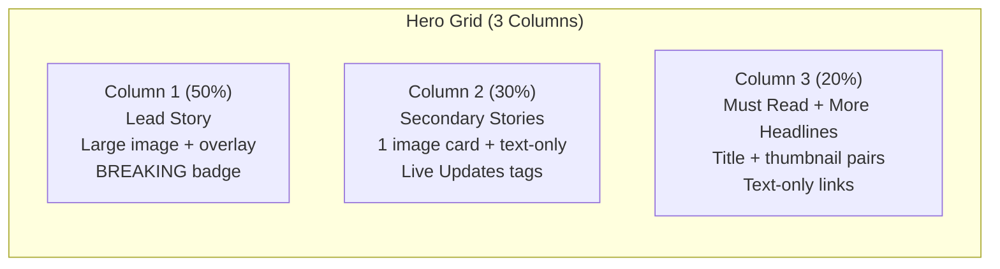
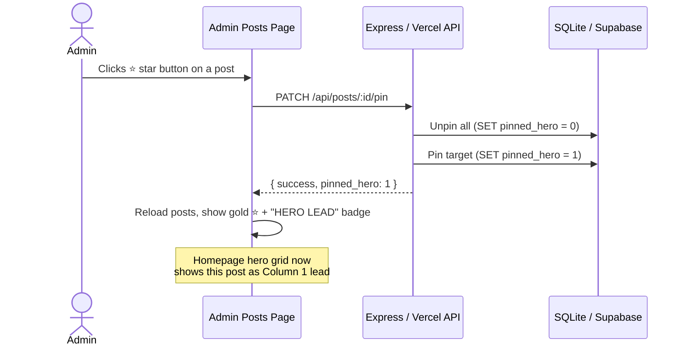

# Fact Check Master — Session Walkthrough

> **Date:** May 12, 2026  
> **Scope:** Editorial Hero Redesign, Staging Environment Setup, Pin-to-Hero Feature  
> **Status:** All objectives complete. Ready for production deployment.

---

## Table of Contents

1. [Objective](#objective)
2. [Infrastructure & Environment Setup](#infrastructure--environment-setup)
3. [Navigation Bar Simplification](#navigation-bar-simplification)
4. [Hero Editorial Grid — Al Jazeera-Inspired Layout](#hero-editorial-grid--al-jazeera-inspired-layout)
5. [Admin Authentication Fix (Local Dev)](#admin-authentication-fix-local-dev)
6. [Pin-to-Hero Feature](#pin-to-hero-feature)
7. [Database Schema Changes](#database-schema-changes)
8. [Files Modified](#files-modified)
9. [Deployment Checklist](#deployment-checklist)

---

## Objective

Modernize the Fact Check Master homepage with a professional, **Al Jazeera-inspired editorial hero layout**, establish a safe local testing workflow using a **staging Supabase** instance, and add an admin **Pin-to-Hero** toggle so the admin can control which post appears as the lead story on the homepage.

---

## Infrastructure & Environment Setup

### Staging Supabase Project

A new staging Supabase project was provisioned to avoid touching the live production database during development.

| Property | Value |
|---|---|
| **Project ID** | `unqtnkzxqcdvshwslwdp` |
| **URL** | `https://unqtnkzxqcdvshwslwdp.supabase.co` |
| **Purpose** | Local development & testing only |

### Environment Configuration

#### [.env.local](file:///c:/Users/qzulk/Desktop/ISPR/Fact%20Check%20Master/.env.local)

Created to point the local dev server at the staging Supabase:

```env
SUPABASE_URL=https://unqtnkzxqcdvshwslwdp.supabase.co
SUPABASE_SERVICE_ROLE_KEY=eyJhbGci...  (staging key)
```

> [!IMPORTANT]
> This file is **gitignored** and only affects local development. The production Vercel deployment uses its own environment variables pointing to the production Supabase.

### Local Dev Workflow

The application runs locally via:

```bash
npm run start
```

This runs **concurrently**:
- `npm run dev` → Vite frontend on `http://localhost:5173`
- `npm run start:server` → Express API on `http://localhost:3001`

Vite proxies all `/api/*` requests to the Express server.

---

## Navigation Bar Simplification

### Before
The navbar contained all category links, making it cluttered.

### After
Simplified to a clean professional structure with only core links:

| Link | Path |
|---|---|
| Home | `/` |
| Latest News | `/latest-news` |
| Trending | `/trending` |
| News Dashboard | `/news-dashboard` |
| About | `/about` |
| Contact | `/contact` |

All other categories are accessible from the **News Dashboard** page.

#### Modified File
- [Navbar.jsx](file:///c:/Users/qzulk/Desktop/ISPR/Fact%20Check%20Master/src/components/Navbar.jsx)

---

## Hero Editorial Grid — Al Jazeera-Inspired Layout

### Design Philosophy

The hero section was completely redesigned to match Al Jazeera's editorial grid pattern — a clean, information-dense, three-column layout that prioritizes readability and visual hierarchy.

### Layout Structure



### Key Design Decisions

| Decision | Rationale |
|---|---|
| **Dark theme** (no white override) | Matches the site's existing dark aesthetic |
| **No fallback image** | When posts have no image, a subtle gradient card is used instead of a placeholder |
| **Red `#CC0000` accent** | Breaking badge, live dots — matches Al Jazeera's urgency signaling |
| **Orange `#F59E0B` accents** | Must Read / More Headlines section headers |
| **`pinned_hero` awareness** | The pinned post always takes Column 1 lead position |

### Column Breakdown

#### Column 1 — Lead Story
- Full-width image with `16:9` aspect ratio
- Gradient overlay at bottom with white text
- Red "BREAKING" or "Featured" badge
- Excerpt text below title
- If no image: dark gradient card with text

#### Column 2 — Secondary Stories
- First item: image card + title
- Remaining items: text-only with red pulsing "Live Updates" dot
- Separated by subtle border lines

#### Column 3 — Sidebar
- **Must Read**: Title + small thumbnail (88x60px) pairs with orange accent bar
- **More Headlines**: Text-only links with subtle separator

### Responsive Breakpoints

| Breakpoint | Grid |
|---|---|
| `≥1024px` | 3 columns: `5fr 3fr 2.5fr` |
| `768px–1023px` | 2 columns: `1fr 1fr` |
| `<768px` | 1 column (stacked) |

#### Modified File
- [HeroEditorialGrid.jsx](file:///c:/Users/qzulk/Desktop/ISPR/Fact%20Check%20Master/src/components/HeroEditorialGrid.jsx)

---

## Admin Authentication Fix (Local Dev)

### Problem
Login was failing locally because the admin panel uses **device fingerprinting** via a Vercel serverless function (`/api/device-auth`). The local Express server didn't have this endpoint.

### Solution
Added a **mock device-auth endpoint** to the Express dev server:

```javascript
// server/index.js
app.post('/api/device-auth', (req, res) => {
  res.json({ approved: true });
});
```

> [!NOTE]
> This mock endpoint only exists in the local Express server. The production Vercel deployment continues to use the real device authorization with RLS policies.

### Admin Credentials (Local Dev)
- **Username:** `factadmin`
- **Password:** `factadmin`

#### Modified File
- [server/index.js](file:///c:/Users/qzulk/Desktop/ISPR/Fact%20Check%20Master/server/index.js) (lines 184-187)

---

## Pin-to-Hero Feature

### Overview

A new **"Pin to Hero"** toggle was added so the admin can designate exactly which post appears as the lead story (Column 1) in the hero grid. Only **one post** can be pinned at a time.

### How It Works



### Admin UI Changes

Each post in the **Admin > Posts** list now has 3 action buttons:

| Button | Icon | Action |
|---|---|---|
| **Pin** | ⭐ (star) | Toggle pin-to-hero. Gold = pinned, Grey = unpinned |
| **Edit** | ✏️ (pencil) | Edit the post |
| **Delete** | 🗑️ (trash) | Delete the post |

When a post is pinned:
- The star turns **gold** with a gold border
- A **"HERO LEAD"** gold badge appears next to the post title
- Pinning a different post auto-unpins the previous one

### API Endpoints Added

#### Local Express Server (`server/index.js`)
```
PATCH /api/posts/:id/pin
```
- Toggles `pinned_hero` between `0` and `1`
- Unpins all other posts before pinning the new one
- Broadcasts update via WebSocket

#### Vercel Serverless (`api/posts.js`)
```
PATCH /api/posts?id=:id
```
- Same toggle logic using Supabase
- Requires approved admin device header

### Hero Grid Logic

The [HeroEditorialGrid.jsx](file:///c:/Users/qzulk/Desktop/ISPR/Fact%20Check%20Master/src/components/HeroEditorialGrid.jsx) `loadHero` function now:

1. Fetches breaking/featured posts
2. Checks if any post has `pinned_hero = true`
3. If found → that post becomes Column 1 lead; remaining posts fill Columns 2 & 3
4. If not found → falls back to most recent post as lead

#### Modified Files
- [server/index.js](file:///c:/Users/qzulk/Desktop/ISPR/Fact%20Check%20Master/server/index.js) — new column + PATCH endpoint + sort order
- [api/posts.js](file:///c:/Users/qzulk/Desktop/ISPR/Fact%20Check%20Master/api/posts.js) — PATCH handler + sort order
- [AdminPosts.jsx](file:///c:/Users/qzulk/Desktop/ISPR/Fact%20Check%20Master/src/pages/AdminPosts.jsx) — star button + HERO LEAD badge
- [HeroEditorialGrid.jsx](file:///c:/Users/qzulk/Desktop/ISPR/Fact%20Check%20Master/src/components/HeroEditorialGrid.jsx) — pinned_hero-aware lead selection

---

## Database Schema Changes

### New Column: `pinned_hero`

| Database | Type | Default | Constraint |
|---|---|---|---|
| SQLite (local) | `INTEGER` | `0` | Only one row should have `1` |
| Supabase (production) | `BOOLEAN` | `FALSE` | Only one row should have `TRUE` |

### Migration Scripts

#### SQLite (auto-runs on server start)
```sql
-- server/index.js initDb()
ALTER TABLE posts ADD COLUMN pinned_hero INTEGER DEFAULT 0;
```

#### Supabase (manual — run in SQL Editor)

The [supabase-hero-updates.sql](file:///c:/Users/qzulk/Desktop/ISPR/Fact%20Check%20Master/supabase-hero-updates.sql) file now includes:

```sql
-- Add pinned_hero column
DO $$
BEGIN
    IF NOT EXISTS (
        SELECT 1 FROM information_schema.columns
        WHERE table_name = 'posts' AND column_name = 'pinned_hero'
    ) THEN
        ALTER TABLE posts ADD COLUMN pinned_hero BOOLEAN DEFAULT FALSE;
    END IF;
END $$;

-- Performance index
CREATE INDEX IF NOT EXISTS idx_posts_pinned_hero
ON posts (pinned_hero) WHERE pinned_hero = TRUE;
```

### Query Sort Order

All post queries now sort by:
```sql
ORDER BY IFNULL(pinned_hero, 0) DESC, created_at DESC
```
This ensures the pinned post always appears first in API responses.

---

## Files Modified

### Summary Table

| File | Change Type | Description |
|---|---|---|
| [.env.local](file:///c:/Users/qzulk/Desktop/ISPR/Fact%20Check%20Master/.env.local) | **NEW** | Staging Supabase credentials |
| [server/index.js](file:///c:/Users/qzulk/Desktop/ISPR/Fact%20Check%20Master/server/index.js) | **MODIFIED** | Mock auth, pinned_hero column, PATCH endpoint, sort order |
| [api/posts.js](file:///c:/Users/qzulk/Desktop/ISPR/Fact%20Check%20Master/api/posts.js) | **MODIFIED** | PATCH handler, pinned_hero sort in Supabase queries |
| [src/components/HeroEditorialGrid.jsx](file:///c:/Users/qzulk/Desktop/ISPR/Fact%20Check%20Master/src/components/HeroEditorialGrid.jsx) | **REWRITTEN** | Al Jazeera editorial grid, dark theme, pinned_hero lead |
| [src/components/Navbar.jsx](file:///c:/Users/qzulk/Desktop/ISPR/Fact%20Check%20Master/src/components/Navbar.jsx) | **MODIFIED** | Simplified nav links |
| [src/pages/AdminPosts.jsx](file:///c:/Users/qzulk/Desktop/ISPR/Fact%20Check%20Master/src/pages/AdminPosts.jsx) | **MODIFIED** | Pin star button, HERO LEAD badge, FaStar import |
| [supabase-hero-updates.sql](file:///c:/Users/qzulk/Desktop/ISPR/Fact%20Check%20Master/supabase-hero-updates.sql) | **MODIFIED** | Added pinned_hero column + index migration |
| [vercel.json](file:///c:/Users/qzulk/Desktop/ISPR/Fact%20Check%20Master/vercel.json) | Unchanged | Routing config (no changes needed) |

---

## Deployment Checklist

> [!WARNING]
> The following steps are required to deploy these changes to production.

### Step 1: Run Supabase Migration
1. Open your **Production** Supabase project SQL Editor
2. Paste and run the contents of [supabase-hero-updates.sql](file:///c:/Users/qzulk/Desktop/ISPR/Fact%20Check%20Master/supabase-hero-updates.sql)
3. Verify: `SELECT column_name FROM information_schema.columns WHERE table_name = 'posts' AND column_name = 'pinned_hero';` returns 1 row

### Step 2: Commit & Push
```bash
git add -A
git commit -m "feat: Al Jazeera hero layout + pin-to-hero toggle"
git push origin main
```

### Step 3: Verify on Vercel
1. Wait for Vercel deployment to complete
2. Test the admin panel — pin a post and check the homepage
3. The mock `/api/device-auth` endpoint in `server/index.js` does **NOT** affect production (Vercel uses the serverless functions in `/api/`)

### Step 4: Content Seeding
1. Log into the production admin panel
2. Tag existing posts with `breaking-news` or `featured-news` category
3. Pin your preferred lead story using the ⭐ button

> [!TIP]
> The `.env.local` file is automatically gitignored by Vite, so your staging credentials will never be committed to the repository.
